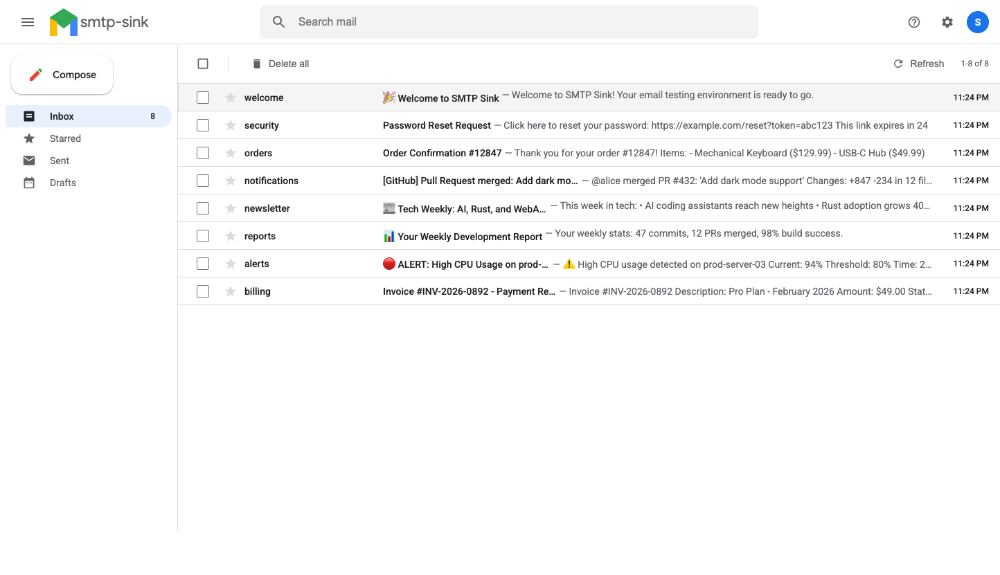

# smtp-sink 📧

A minimal SMTP sink for local development and testing. Receives emails via SMTP and exposes them via HTTP for inspection.

## Features

- SMTP server on configurable port (default: 1025)
- HTTP REST API for email retrieval (default: 1080)
- WebSocket for real-time updates
- Web UI for visual inspection
- Ring buffer with configurable max emails
- Sender whitelist filtering
- SMTP AUTH (PLAIN and LOGIN mechanisms)
- STARTTLS support (upgrade plain connection to TLS)
- Implicit TLS/SMTPS support
- Catch-all routing (accepts any recipient domain)
- **Attachment parsing and download** via API
- **SQLite persistence** (optional) - survive restarts
- **Search/filter API** - query by from, to, subject, date
- **Email forwarding** - relay to external SMTP server

## Screenshots




## Installation

### From source

```bash
cargo install --path .
```

### Homebrew (macOS/Linux)

```bash
brew install jimmystridh/tap/smtp-sink
```

### Arch Linux (AUR)

```bash
yay -S smtp-sink
```

### Pre-built binaries

Download from [GitHub Releases](https://github.com/jimmystridh/smtp-sink/releases).

## Docker

```bash
# Run with default settings
docker run -p 1025:1025 -p 1080:1080 jimmystridh/smtp-sink

# With authentication
docker run -p 1025:1025 -p 1080:1080 jimmystridh/smtp-sink \
  --auth-username user --auth-password pass

# With self-signed TLS
docker run -p 1025:1025 -p 1080:1080 jimmystridh/smtp-sink \
  --tls --tls-self-signed

# With SQLite persistence
docker run -p 1025:1025 -p 1080:1080 -v ./data:/data jimmystridh/smtp-sink \
  --db /data/emails.db
```

## Usage

```bash
# Basic usage (accepts all emails, no auth)
smtp-sink

# Custom ports
smtp-sink --smtp-port 2525 --http-port 8080

# With sender whitelist
smtp-sink --whitelist alice@example.com,bob@example.com

# With SMTP AUTH (optional authentication)
smtp-sink --auth-username myuser --auth-password mypass

# With required SMTP AUTH
smtp-sink --auth-required --auth-username myuser --auth-password mypass

# With STARTTLS
smtp-sink --starttls --tls-self-signed

# With implicit TLS (SMTPS)
smtp-sink --tls --tls-self-signed

# With custom certificates
smtp-sink --tls --tls-key ./key.pem --tls-cert ./cert.pem

# With SQLite persistence (emails survive restart)
smtp-sink --db ./emails.db

# Forward all emails to another server
smtp-sink --forward-host smtp.example.com --forward-port 587 --forward-tls \
  --forward-username user --forward-password pass

# Forward with recipient override (catch-all redirect)
smtp-sink --forward-host smtp.example.com --forward-to dev@example.com
```

## Options

```
-s, --smtp-port <PORT>     SMTP port [default: 1025]
-p, --http-port <PORT>     HTTP port [default: 1080]
-w, --whitelist <ADDRS>    Comma-separated allowed senders
-m, --max <N>              Max emails to keep [default: 10]
    --tls                  Enable implicit TLS (SMTPS)
    --starttls             Enable STARTTLS
    --tls-key <PATH>       TLS private key (PEM)
    --tls-cert <PATH>      TLS certificate (PEM)
    --tls-self-signed      Generate self-signed certificate
    --auth-required        Require authentication before sending
    --auth-username <USER> Username for SMTP AUTH
    --auth-password <PASS> Password for SMTP AUTH
    --db <PATH>            SQLite database path for persistence
    --forward-host <HOST>  Forward emails to this SMTP host
    --forward-port <PORT>  Forward SMTP port (default: 587/465)
    --forward-tls          Use STARTTLS when forwarding
    --forward-implicit-tls Use implicit TLS (SMTPS) when forwarding
    --forward-username <U> SMTP username for forwarding
    --forward-password <P> SMTP password for forwarding
    --forward-to <ADDR>    Override all recipients (catch-all redirect)
    --forward-from <ADDR>  Override sender when forwarding
```

## API

| Method | Endpoint | Description |
|--------|----------|-------------|
| GET | `/` | Web UI |
| GET | `/emails` | List all emails (JSON) |
| GET | `/emails?from=alice&subject=test` | Search/filter emails |
| GET | `/emails/:id` | Get single email |
| DELETE | `/emails` | Clear all emails |
| DELETE | `/emails/:id` | Delete single email |
| GET | `/emails/:id/attachments` | List attachments |
| GET | `/emails/:id/attachments/:filename` | Download attachment |
| GET | `/ws` | WebSocket for real-time updates |

### Search Parameters

| Parameter | Description |
|-----------|-------------|
| `from` | Filter by sender (partial match) |
| `to` | Filter by recipient (partial match) |
| `subject` | Filter by subject (partial match) |
| `since` | Filter emails since date (ISO 8601) |
| `until` | Filter emails until date (ISO 8601) |

## Example

```bash
# Start the sink
smtp-sink

# Send a test email (catch-all accepts any domain)
echo -e "HELO localhost\nMAIL FROM:<test@example.com>\nRCPT TO:<anyone@anywhere.com>\nDATA\nSubject: Hello\n\nTest message\n.\nQUIT" | nc localhost 1025

# View emails
curl http://localhost:1080/emails

# Search by sender
curl "http://localhost:1080/emails?from=test@example.com"

# Get attachments
curl http://localhost:1080/emails/{id}/attachments
```

## License

MIT
